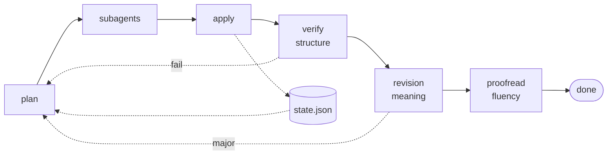

# i18n

**Keep translated docs in sync with the originals, without them quietly rotting.**

[](https://github.com/koko-t7i/i18n/actions/workflows/ci.yml)
[](LICENSE)
[](pyproject.toml)

[简体中文](README.zh-CN.md)

An agent skill for [Claude Code](https://claude.com/claude-code) and
[Codex](https://developers.openai.com/codex). Subagents write the prose; scripts do
everything that must not be left to a model. No translation API, no API keys.

## Quickstart

```bash
git clone git@github.com:koko-t7i/i18n.git ~/icode/skills/i18n
ln -s ~/icode/skills/i18n/i18n ~/.claude/skills/i18n     # Claude Code
ln -s ~/icode/skills/i18n/i18n ~/.codex/skills/i18n      # Codex
```

One directory, both harnesses — link whichever you use, or both. Needs
[`uv`](https://docs.astral.sh/uv/) on `PATH`, which supplies Python 3.13 and the two
dependencies per-run and installs nothing globally.

Then just ask — *把 README 和 docs 翻译成中文*, *sync the Japanese docs*, *check the
translations still match*, *re-translate the installation guide from scratch*.

Ask again later and unchanged files are skipped. Translations you edited by hand are detected
and never overwritten without you saying so.

## Why not just ask the model to translate the file?

A one-shot translation is right once and wrong forever after. Three things go wrong, and all
three are silent:

| Failure | What happens | Caught by |
|---|---|---|
| **Drift** | You fix a typo in `README.md`; the translation still describes last month's behaviour | content hashes |
| **Structure damage** | A flag name inside backticks gets translated, or `{count}` becomes `{数量}` — the doc looks fine, the copied command breaks | the verifier |
| **Terminology drift** | "skill" is 技能 in one paragraph and 技巧 three paragraphs later | a glossary `forbid` list |

## What it handles

| | |
|---|---|
| **Documentation** | `.md`, `.mdx`, `.markdown` — README, `docs/**`, `SKILL.md` |
| **Resources** | `.json`, `.yaml`/`.yml`, `.properties`, `.po`/`.pot` |
| **Not handled** | source-code comments, strings inside source code, docs-site config (`mkdocs.yml` nav, `docusaurus.config.js`) |

For Docusaurus translate `i18n/<locale>/**.json` instead — a resource file, fully supported.

## What gets checked

Every translation is compared against its source before it is accepted. These fail the run:

| Check | Asserts |
|---|---|
| `X-INLINE` | inline code is byte-identical — the check that earns its keep, since `` `{数量}` `` passes every other one and breaks the copied command |
| `X-TOKEN` | placeholders match — `{count}`, `%s`, `${VAR}`, `{{var}}` |
| `X-FENCE` | code fence count, language tags and bodies unchanged |
| `X-HTML` | HTML tag multiset matches the source |
| `X-LINK` | external URLs verbatim, internal link count preserved |
| `X-HEADING` | heading level sequence matches element-wise |
| `X-GLOSSARY` | required terms present, forbidden renderings absent |
| `X-CHATTER` | no "here is the translation" preamble |

Warnings only: `X-DEADLINK`, `X-ANCHOR`, `X-UNTRANSLATED`, `X-ORPHAN`, `X-STYLE`.

On failure only the offending chunk is retried, with the finding attached. After two rounds
it stops and names the file that needs a human.

All of that compares *structure*. It cannot catch a paragraph that reads perfectly and says
the opposite of the source. Two further passes do, and they are kept apart on purpose:

| Pass | Sees | Judges | Blocks? |
|---|---|---|---|
| **revision** | source **and** translation | accuracy, terminology, audience fit | yes |
| **proofread** | **translation only** | fluency, style, locale | no |

The proofreader is not shown the source, which is the method rather than an oversight: a
sentence that maps neatly onto its source reads as correct even when no native writer would
phrase it that way. Each pass costs one model call per file, so it is opt-in — see
[`review.md`](i18n/references/review.md).

Two optional files, both committed, keep runs consistent with each other:
[`glossary.json`](i18n/references/glossary.md) fixes individual words,
[`style.json`](i18n/references/style.md) fixes everything between them — register, how the
reader is addressed, quotation marks, CJK/Latin spacing.

> [!NOTE]
> **Anchors from another file are not rewritten.** Translating a heading moves its anchor,
> and links to it from *other* files land at the top of the page instead. `X-ANCHOR` warns.
> Fixing it needs a repo-wide anchor map — not implemented, and it matters far more for a
> cross-linked docs site than for a README plus a few guides.

## Where state lives

Under the directory your agent already owns: `.claude/i18n/` for Claude Code, `.codex/i18n/`
for Codex.

| Path | Commit? | Purpose |
|---|---|---|
| `<state-dir>/state.json` | **yes** | translation lockfile: source hashes, plus both sides of every chunk |
| `<state-dir>/glossary.json` | **yes** | terminology, if you use one |
| `<state-dir>/style.json` | **yes** | style conventions, if you use them |
| `<state-dir>/work/` | no | per-run scratch — gitignore it |

A repo that already has one keeps it, whichever agent you open it with — two lockfiles cannot
see each other's chunk cache, and a split would silently re-translate everything.
`--state-dir` overrides the choice.

> [!IMPORTANT]
> The common `.gitignore` recipe denies `.claude/` (or `.codex/`) wholesale, which silently
> untracks `state.json` and makes the next fresh clone re-translate everything. The skill
> runs `git check-ignore` first and warns. Allowlist it — `!.claude/i18n/` then
> `.claude/i18n/work/` — or keep state in `.i18n/`.

## How it works

Scripts decide what is true; subagents write prose. Three boxes call a model — the
translators and the two review passes — and everything else is deterministic. Dashed arrows
write state or loop back; every failure re-enters at `plan`, which re-emits tasks for the
offending chunks alone.



### A subagent cannot break a code block

**Code blocks become `@@CODE_BLOCK_n@@` tokens before any model sees the text** and are
restored on reassembly. What reaches the translator is the token, and the token is checked.

The invariant is that **feeding every chunk back unchanged reproduces the source byte for
byte**. The tests assert it on real documents, on fences nested in blockquotes and list
items, and on a 4000-word paragraph. Reassembly refuses to write a damaged file when a token
is dropped, mangled or duplicated, or when a chunk is missing or duplicated.

### Frontmatter is edited, not re-serialised

The original block is kept and scalar values substituted line by line, so comments, key order
and quoting survive. Round-tripping through a YAML dumper — the obvious implementation —
silently reformats all three.

### Layout follows your repo

`README.zh-CN.md`, `docs/zh-CN/`, `README_CN.md`, … — the convention already in the repo is
detected rather than imposed, and relative links are rewritten to match wherever the
translation lands.

### Chunking, the cache, and translation memory

Documents split on a character budget, preferring H1/H2 boundaries, and each chunk is cached
under the hash of its source. Unchanged files are skipped entirely.

The cache is only as fine as the chunks, so a short document has no exact hit once one word
changes. The state file therefore stores each chunk's **source** beside its translation: a
changed chunk is matched against the nearest previous one and handed over as an **edit**,
not a blank page. Measured on this README — 54 insertions and 44 deletions without the
previous translation, 34 and **0** with it.

## Development

`uv run --with ruff ruff check .` and `python3 -m unittest discover tests`. The rest,
including the things that will bite you, is in [CONTRIBUTING.md](CONTRIBUTING.md).

## License

MIT.
