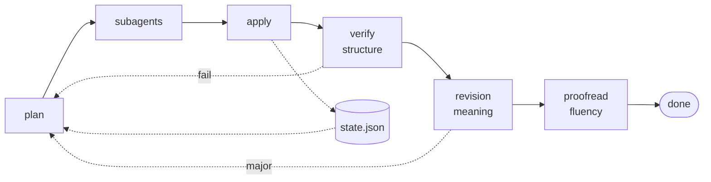

# i18n

**让译文与原文保持同步，不再悄无声息地腐烂。**

[](https://github.com/koko-t7i/i18n/actions/workflows/ci.yml)
[](LICENSE)
[](pyproject.toml)

[English](README.md)

一个面向 [Claude Code](https://claude.com/claude-code) 与
[Codex](https://developers.openai.com/codex) 的 agent 技能。子代理负责写译文；脚本负责
一切不能交给模型的事。不需要翻译 API，也不需要任何 API 密钥。

## 快速开始

```bash
git clone git@github.com:koko-t7i/i18n.git ~/icode/skills/i18n
ln -s ~/icode/skills/i18n/i18n ~/.claude/skills/i18n     # Claude Code
ln -s ~/icode/skills/i18n/i18n ~/.codex/skills/i18n      # Codex
```

一个目录，两个 harness —— 你用哪个就链接哪个，也可以两个都链。需要 `PATH` 中有
[`uv`](https://docs.astral.sh/uv/)；它会按次提供 Python 3.13 与那两个依赖，不做任何全局安装。

然后直接提出需求即可 —— *把 README 和 docs 翻译成中文*、*sync the Japanese docs*、
*检查译文是否还与原文一致*、*把安装指南整篇重新翻译一遍*。

之后再提，未变动的文件会被跳过。你手工改过的译文会被识别出来，未经你许可绝不覆盖。

## 为什么不直接让模型翻译这个文件？

一次性翻译只在当下正确，之后就一直错下去。有三件事会出问题，而且三件都是无声的：

| 失效方式 | 会发生什么 | 由谁拦下 |
|---|---|---|
| **漂移** | 你在 `README.md` 里改了个错别字；译文描述的还是上个月的行为 | 内容哈希 |
| **结构损坏** | 反引号里的参数名被翻译，或 `{count}` 变成 `{数量}` —— 文档看着正常，复制走的命令却坏了 | 校验器 |
| **术语漂移** | 「skill」在这一段是 技能，三段之后又成了 技巧 | 术语表的 `forbid` 列表 |

## 覆盖范围

| | |
|---|---|
| **文档** | `.md`、`.mdx`、`.markdown` —— README、`docs/**`、`SKILL.md` |
| **资源文件** | `.json`、`.yaml`/`.yml`、`.properties`、`.po`/`.pot` |
| **不覆盖** | 源码注释、源码内的字符串、文档站配置（`mkdocs.yml` 的 nav、`docusaurus.config.js`） |

Docusaurus 请改为翻译 `i18n/<locale>/**.json` —— 那属于资源文件，完全支持。

## 会检查哪些项

每份译文在被接受之前都会与原文比对。以下任一项不通过即判定整次运行失败：

| 检查项 | 断言内容 |
|---|---|
| `X-INLINE` | 行内代码逐字节一致 —— 最物有所值的一项，因为 `` `{数量}` `` 能通过其余所有检查，却让复制走的命令失效 |
| `X-TOKEN` | 占位符一致 —— `{count}`、`%s`、`${VAR}`、`{{var}}` |
| `X-FENCE` | 代码围栏数量、语言标签与内容均未改动 |
| `X-HTML` | HTML 标签多重集与原文一致 |
| `X-LINK` | 外部 URL 逐字保留，内部链接数量不变 |
| `X-HEADING` | 标题层级序列逐元素一致 |
| `X-GLOSSARY` | 必需术语出现，被禁译法不出现 |
| `X-CHATTER` | 没有「以下是翻译」这类开场白 |

只告警的：`X-DEADLINK`、`X-ANCHOR`、`X-UNTRANSLATED`、`X-ORPHAN`、`X-STYLE`。

失败时只有出问题的那个分块会带着具体发现被退回重译。两轮之后就停下，并点名哪个文件需要人工介入。

以上比对的都是*结构*，抓不出一段读起来天衣无缝、意思却与原文相反的文字。为此还有两个阶段，
而且刻意把它们分开：

| 阶段 | 看到什么 | 判定什么 | 是否阻断？ |
|---|---|---|---|
| **修订** | 原文**与**译文 | 准确性、术语、受众适配 | 是 |
| **校对** | **仅译文** | 流畅度、风格、locale | 否 |

校对者看不到原文，这是方法本身而非疏漏：一句与原文严丝合缝对应的话读起来就是对的，即便没有任何
母语作者会那样表达。每个阶段都会让每个文件多一次模型调用，因此它是一项选择 —— 参见
[`review.md`](i18n/references/review.md)。

两个可选文件，都需要提交，让多次运行之间保持一致：
[`glossary.json`](i18n/references/glossary.md) 约束单个词，
[`style.json`](i18n/references/style.md) 约束词与词之间的一切 —— 语域、如何称呼读者、引号、
CJK/Latin 间距。

> [!NOTE]
> **来自其他文件的锚点不会被改写。** 翻译标题会让它的锚点随之改变，来自*其他*文件、指向它的
> 链接就会落在页面顶部。`X-ANCHOR` 会告警。要修好它需要一张全仓库的锚点映射表 —— 尚未实现，
> 而且它对互相深链的文档站影响远大于「一个 README 加几篇指南」。

## 状态文件存放位置

就放在你的 agent 已经拥有的那个目录下：Claude Code 用 `.claude/i18n/`，Codex 用
`.codex/i18n/`。

| 路径 | 是否提交 | 用途 |
|---|---|---|
| `<state-dir>/state.json` | **是** | 翻译锁文件：源文件哈希，以及每个分块的原文与译文两侧 |
| `<state-dir>/glossary.json` | **是** | 术语表，如果你用的话 |
| `<state-dir>/style.json` | **是** | 风格约定，如果你用的话 |
| `<state-dir>/work/` | 否 | 每次运行的临时目录 —— 请 gitignore |

仓库里已经有一个的话就沿用它，无论你用哪个 agent 打开 —— 两个锁文件看不到彼此的分块缓存，
一旦分裂就会悄悄把所有内容重新翻译一遍。`--state-dir` 可以覆盖这一选择。

> [!IMPORTANT]
> 常见的 `.gitignore` 写法是整体拒绝 `.claude/`（或 `.codex/`），这会静默地把 `state.json` 排除在
> 版本控制之外，下一次全新 clone 就会把所有内容重新翻译一遍。本技能会先执行 `git check-ignore`
> 并告警。把它放行 —— `!.claude/i18n/` 再加 `.claude/i18n/work/` —— 或者把状态放到 `.i18n/`。

## 工作原理

脚本负责判定什么是事实，子代理负责写文字。有三个方框会调用模型 —— 翻译者与两轮审校 ——
其余部分全都是确定性的。虚线箭头写状态或回环；任何失败都会从 `plan` 重新进入，它只为出问题的
那些分块重新派发任务。



### 子代理无法破坏代码块

**代码块在任何模型看到文本之前就已变成 `@@CODE_BLOCK_n@@` 标记**，并在重组时还原。
送到翻译者手里的是那个标记，而这是会被检查的。

核心不变式是：**把每个分块原样送回，必须逐字节复现原文**。测试在真实文档、引用块
与列表项内的嵌套围栏，以及一个 4000 词的段落上都断言了这一点。当标记被删除、篡改
或重复，或分块缺失、重复时，重组会拒绝写出已损坏的文件。

### frontmatter 是就地编辑而非重新序列化

原始块被保留、标量值按行替换，因此注释、键顺序与引号风格全部存活。经 YAML dumper
往返一圈 —— 最显而易见的那种实现 —— 会悄无声息地把这三样全部重排格式。

### 布局沿用你的仓库

`README.zh-CN.md`、`docs/zh-CN/`、`README_CN.md` …… —— 仓库里既有的约定是被检测出来的
而非强加的，并重写相对链接以匹配译文最终落到的位置。

### 分块、缓存与翻译记忆

文档按字符预算切分、优先在 H1/H2 处断开，每个分块以其源文本的哈希为键缓存。未变动的
文件会被整体跳过。

缓存的精细程度取决于分块，因此短文档一旦改动一个词就不再有精确命中。于是状态文件把每个
分块的**原文**与它的译文并存：变动过的分块会与最接近的上一个版本比对，并作为一次**编辑**
交给翻译者，而不是一张白纸。在本 README 上实测 —— 不带上一版译文是 54 行新增、44 行删除，
带上则是 34 与 **0**。

## 开发

`uv run --with ruff ruff check .` 与 `python3 -m unittest discover tests`。其余部分，
包括那些会咬到你的坑，都在 [CONTRIBUTING.md](CONTRIBUTING.md) 里。

## 许可证

MIT。
